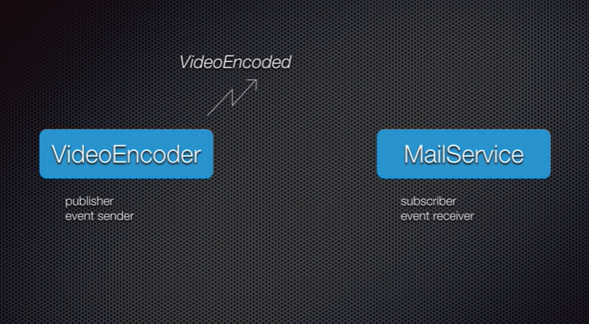

# EventsAndDelegates

This repository contains C# code that demonstrates how to use Events and Delegates. This is an important concept, which involves use of the Publish Subscribe pattern. Say we want to encode a video and then send an email when it is complete. Then later on, we want to also send a text message. 

Without Events and Delegates, if we want to add this functionality at the end of the encoding event, we would have to update and recompile the Encoding code to signal the text message service, and then retest it to avoid potentially breaking the code. In this framework, at the end of the encoding event, it can send a general signal to all subscribing parties, which would trigger them to do the appropriate actions. The Encoding code would not have to be recompiled or tested; instead, we would simply add the text message service as a subscriber to the encoding event in the higher-level program, leaving the Encoding code perfect as is.

On the last commit, I switched from using both a `Delegate` and `Event` to simply using an `EventHandler<TEventArgs>`.

I learned about Events and Delegates through https://www.youtube.com/watch?v=jQgwEsJISy0&t=1635s. Thank you for the information.
